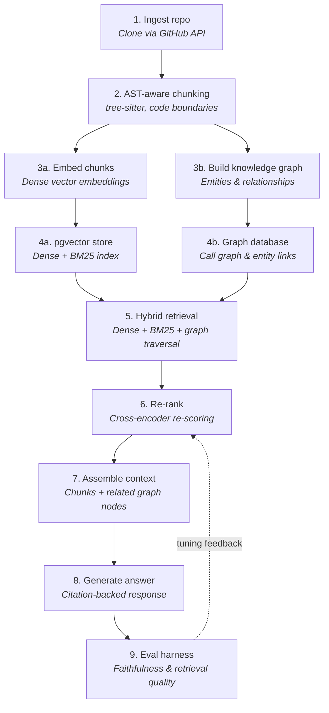

# RAG Architecture

This documents the architecture for Foundry's "understand this repo" RAG feature — ingesting a codebase, retrieving relevant context, and generating grounded answers.

## Flow

## Design rationale

**AST-aware chunking over fixed-size windows.** Splitting on function and class boundaries (via `tree-sitter`) keeps every chunk semantically complete — a retrieved chunk is a whole function, not an arbitrary slice of one. This directly improves retrieval precision, since the model is never reasoning over a fragment with missing context.

**pgvector over a standalone vector database.** Pinecone, Weaviate, and similar services earn their value at large scale with approximate-nearest-neighbor indexing. `pgvector` gets the same dense + hybrid search capability as a Postgres extension — no separate service, no extra API keys, and it consolidates onto infrastructure the rest of the system already needs for durable storage.

**Hybrid retrieval (dense + BM25) over dense-only.** Dense embeddings are strong for semantic similarity but weak on exact matches — a search for a specific function or variable name can lose to something merely "related" in meaning. Fusing dense retrieval with keyword (BM25) search catches both cases.

**Cross-encoder re-ranking as a second pass.** Initial retrieval (dense + BM25) is optimized for speed across the full index. A cross-encoder scores the query and each candidate chunk together rather than comparing independent embeddings, which is more accurate but too expensive to run over everything — so it re-scores only the top candidates from the first pass.

**Knowledge graph for entity and call relationships.** Some questions aren't answerable from any single chunk — "what calls this function" or "what depends on this class" require structural relationships, not just semantic similarity. A graph over entities and their relationships lets retrieval traverse those connections directly.

**Citation-backed generation.** Every answer is grounded only in retrieved context and cites its sources, rather than letting the model answer from general knowledge — this keeps answers traceable back to actual code.

**Evaluation harness with a feedback loop.** Retrieval and generation quality should be measured, not assumed. Scoring faithfulness (does the answer match the cited context) and retrieval quality (are the right chunks being surfaced) closes the loop back into re-ranker tuning.

## Suggested build order

1. **AST-aware chunking** — splits on function/class boundaries instead of raw character windows
2. **pgvector migration** — dense + BM25 hybrid index, also solves ephemeral-disk storage limitations
3. **Hybrid retrieval (dense + BM25)** — meaningful precision gain for exact identifier/name lookups that pure embeddings miss
4. **Re-ranking** — cross-encoder pass over top candidates from hybrid retrieval
5. **Eval harness** — measure faithfulness and retrieval quality before further tuning
6. **Knowledge graph** — entity and call-relationship graph, feeding retrieval and reasoning

