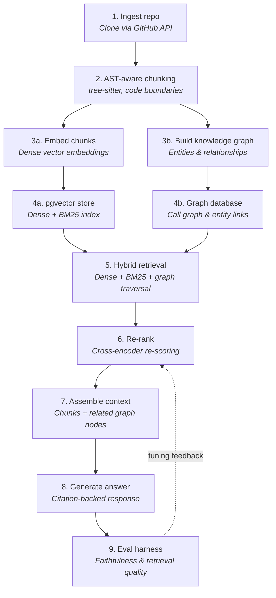

# RAG Architecture — Target Design

_Last updated: Aug 17, 2026_

This documents the target architecture for Foundry's "understand this repo" RAG feature — both what's built today and the full design to build toward. See the status notes under each step for what's real vs. planned.

## Flow

## Step-by-step: current implementation vs. target

| Step | Target design | Currently implemented as |
|---|---|---|
| 1. Ingest repo | Clone via GitHub API | ✅ Same — `github_import.py`, public repos, uses the logged-in user's token for a higher rate limit |
| 2. Chunking | AST-aware, splits on function/class boundaries (`tree-sitter`) | ⚠️ Simplified — plain sliding character window (1200 chars, 150 overlap). Can split a function mid-body. |
| 3a. Embed chunks | Dense embeddings | ✅ Same — `gemini-embedding-001`, batched |
| 3b. Knowledge graph | Entities + call/reference relationships | ❌ Not built |
| 4a. Vector store | pgvector (Postgres) with dense + BM25 hybrid index | ⚠️ Simplified — plain SQLite table, vectors stored as JSON text |
| 4b. Graph database | Dedicated graph store (e.g. Neo4j, or graph-on-Postgres) | ❌ Not built |
| 5. Retrieval | Hybrid: dense + BM25 keyword + graph traversal, fused | ⚠️ Simplified — dense-only, cosine similarity computed in Python at query time |
| 6. Re-ranking | Cross-encoder re-scores top candidates from initial retrieval | ❌ Not built — single-pass retrieval only |
| 7. Context assembly | Retrieved chunks + related graph nodes | ⚠️ Simplified — just the top-K chunks, no graph context |
| 8. Generation | Citation-backed answer | ✅ Same in spirit — answer grounded in retrieved chunks, cites source file paths |
| 9. Eval harness | Automated faithfulness + retrieval-quality scoring, feeds back into re-ranker tuning | ❌ Not built |

## Why these specific simplifications tonight

- **Character-window chunking** instead of AST-aware: zero extra per-language dependencies, works uniformly across any repo. Real cost: can split a function across two chunks.
- **SQLite + Python cosine similarity** instead of pgvector: brute-force search is genuinely fast enough at one-repo scale (hundreds–low-thousands of chunks). No performance problem to solve yet, and avoids adding a hosted vector-DB dependency (more secrets, more infra) before it's needed.
- **No re-ranking**: single-pass dense retrieval only. Real cost: embedding similarity is approximate — a re-ranker (cross-encoder scoring query+chunk together) catches near-misses that pure embedding comparison doesn't.
- **No knowledge graph**: the single biggest lift in this design — a genuinely separate system, not a bolt-on. Correctly built last, after the retrieval fundamentals are solid.

## Suggested build order

1. **AST-aware chunking** — most direct fix to current chunk quality, contained scope
2. **pgvector migration** — also fixes Render's ephemeral-SQLite-disk limitation (documented separately in the main roadmap) — one migration, two problems solved
3. **Hybrid retrieval (dense + BM25)** — meaningful precision gain for exact identifier/name lookups that pure embeddings miss
4. **Re-ranking** — cross-encoder pass over top candidates from hybrid retrieval
5. **Eval harness** — needed before trusting any further tuning; measure before optimizing
6. **Knowledge graph** — biggest lift, build last, once everything above is proven
